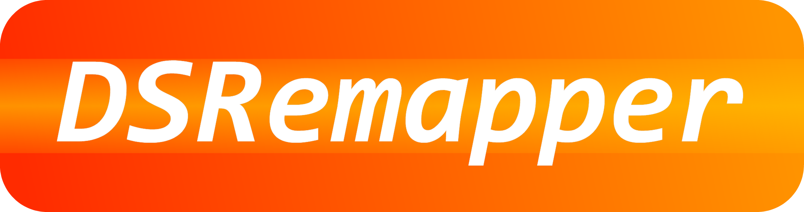

# Welcome to DSRemapper

You can check the [DSRemapper Documentation here](https://github.com/DSRemapper/DSRemapper.Documentation)

DSRemapper stands for (Device Switcher and Remapper) and it's a multi-platform and modular app that can remap almost any input device in a computer into an output device (usually virtual, but can be physical).
This controller remap occurs inside a Remapper plugin, which can be simple or complex, giving the user great flexibility to reasign it's devices in any way.

**DSRemapper has 3 main components/plugins:**
- **Input plugin:** Manages communication with physical input devices (like gamepads) and translates their data into a standard format.
- **Remapper plugin:** Contains the logic for remapping. It receives data from an input plugin, processes it, and sends it to an output plugin.
- **Output plugin:** Handles virtual or physical output devices, taking the remapped data to control them.

**Note:** *This plugins can be multiplatform or be SO dependent individually*

---

The main focus of DSRemapper is the remapping of computer peripherals for advanced users (and, with some help, for casual users too), but you can also see DSRemapper as a powerful framework for device communication and inter-compatibility.
*The applications of DSRemapper only depends on the plugins that are loaded and not on the main framework itself.*